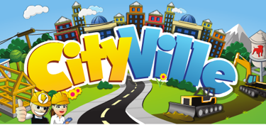

> CityVille(Facebook) officially closed April 30th, 2015

The CityVille preservation project by the mobachocolate team.
This project is dedicated to preserving this Flash game so that it's not lost to time.

---

## Releases

| Version | Update | Release date |  Source  | Download |
| ------- | ------ | ------------ | ------ | -------- |

## Reporting Bugs and Contacting
:speech_balloon: Check our [Discord group](https://discord.gg/rdpFXhja5Q)

## External Links
:beginner: [CityVille Wiki](https://forum.mobachocolate.net)

:beginner: [CityVille Wiki (FANDOM)](https://cityville.fandom.com/wiki/CityVille_Wiki)

:clapper: [CityVille Fan Site](https://cityville.mobachocolate.net)

## On archives and accessibility to digital heritage
- [Exemption to PCCPSACT](https://www.federalregister.gov/documents/2018/10/26/2018-23241/exemption-to-prohibition-on-circumvention-of-copyright-protection-systems-for-access-control), exemptions to the provision of the Digital Millennium Copyright Act (“DMCA”). 
- [EFGAMP](https://efgamp.eu/), the European Federation of Video Game Archives, Museums and Preservation projects.
- [UNESCO PERSIST Programme](https://unescopersist.org/), helps ensure that digital information can continue to be accessed in the future.
- [The Internet Archive](https://archive.org/), a digital library of Internet sites and other cultural artifacts in digital form.
- [Adobe Flash Player Archive](https://archive.org/download/flashplayerarchive/), the Adobe Inc. archive.org Flash Player Archive.

---

## License [](http://www.gnu.org/licenses/gpl-3.0)
```
Old CityVille preservation project.
Copyright (C) 2023  The MobaChocolate team

This program is free software: you can redistribute it and/or modify
it under the terms of the GNU General Public License as published by
the Free Software Foundation, either version 3 of the License, or
(at your option) any later version.

This program is distributed in the hope that it will be useful,
but WITHOUT ANY WARRANTY; without even the implied warranty of
MERCHANTABILITY or FITNESS FOR A PARTICULAR PURPOSE.  See the
GNU General Public License for more details.

You should have received a copy of the GNU General Public License
along with this program.  If not, see <https://www.gnu.org/licenses/>.
```
### Related
```
Chromium 82.0, Copyright 2020-2021 The Chromium Authors. All rights reserved.
Chromium is made possible by the Chromium open source project and other open source software.
```

```
Adobe Flash Player License Terms <http://aka.ms/adobeflash/>.
```
